# 👤 Perfil de Jugador: Generico 3
### Posición Actual: **1º** | Puntos Totales: **243.0**
---
## 📅 Historial Cronológico de Partidos
Aquí tienes el detalle exacto de tus pronósticos y resultados oficiales.
### 📌 J1.1
| Partido Oficial | Tu Pronóstico | Resultado Real | 1X2 | Exacto | Mult. | Pts |
| :--- | :---: | :---: | :---: | :---: | :---: | :---: |
| **Estados Unidos** vs **Paraguay** | **1 - 3** | **3 - 0** | ❌ | --- | x1.0 | **0.0** |
| **Australia** vs **Turquía** | **0 - 2** | **2 - 1** | ❌ | --- | x1.0 | **0.0** |
| **Países Bajos** vs **Japón** | **2 - 1** | **2 - 1** | ✅ | 🎯 | x1.0 | **4.0** |
| **Suecia** vs **Túnez** | **2 - 0** | **1 - 1** | ❌ | --- | x1.0 | **0.0** |
| **Alemania** vs **Curazao** | **2 - 0** | **4 - 1** | ✅ | --- | x1.0 | **1.0** |
| **Costa de Marfil** vs **Ecuador** | **2 - 3** | **1 - 2** | ✅ | --- | x1.0 | **1.0** |
| **México** vs **Sudáfrica** | **2 - 2** | **1 - 0** | ❌ | --- | x1.0 | **0.0** |
| **Corea del Sur** vs **República Checa** | **2 - 2** | **1 - 2** | ❌ | --- | x1.0 | **0.0** |
| **Brasil** vs **Marruecos** | **3 - 1** | **2 - 0** | ✅ | --- | x1.0 | **1.0** |
| **Haití** vs **Escocia** | **0 - 2** | **0 - 2** | ✅ | 🎯 | x1.0 | **4.0** |
| **Canadá** vs **Bosnia-Herzegovina** | **2 - 1** | **2 - 1** | ✅ | 🎯 | x1.0 | **4.0** |
| **Qatar** vs **Suiza** | **1 - 3** | **1 - 2** | ✅ | --- | x1.0 | **1.0** |

> **Resumen de la J1.1:** **3/7** *(Clavados/Aciertos)*. Quedaste en la posición **2º**. | Resultado: ⚪ **Neutral** (0 pts)
> **Puntos sumados esta jornada:** 16.0 pts | **TOTAL ACUMULADO:** 16.0 pts

### 📌 J1.2
| Partido Oficial | Tu Pronóstico | Resultado Real | 1X2 | Exacto | Mult. | Pts |
| :--- | :---: | :---: | :---: | :---: | :---: | :---: |
| **Argentina** vs **Argelia** | **0 - 0** | **4 - 1** | ❌ | --- | x1.0 | **0.0** |
| **Austria** vs **Jordania** | **2 - 0** | **2 - 0** | ✅ | 🎯 | x1.0 | **4.0** |
| **Portugal** vs **RD Congo** | **3 - 0** | **3 - 1** | ✅ | --- | x1.0 | **1.0** |
| **Uzbekistán** vs **Colombia** | **2 - 3** | **0 - 2** | ✅ | --- | x1.0 | **1.0** |
| **Inglaterra** vs **Croacia** | **2 - 0** | **2 - 0** | ✅ | 🎯 | x1.0 | **4.0** |
| **Ghana** vs **Panamá** | **3 - 1** | **2 - 0** | ✅ | --- | x1.0 | **1.0** |
| **Bélgica** vs **Egipto** | **3 - 1** | **2 - 1** | ✅ | --- | x1.0 | **1.0** |
| **Irán** vs **Nueva Zelanda** | **2 - 0** | **1 - 0** | ✅ | --- | x1.0 | **1.0** |
| **España** vs **Cabo Verde** | **2 - 1** | **5 - 1** | ✅ | --- | x1.0 | **1.0** |
| **Arabia Saudita** vs **Uruguay** | **1 - 2** | **0 - 2** | ✅ | --- | x1.0 | **1.0** |
| **Francia** vs **Senegal** | **2 - 1** | **2 - 1** | ✅ | 🎯 | x1.0 | **4.0** |
| **Irak** vs **Noruega** | **0 - 2** | **1 - 3** | ✅ | --- | x1.0 | **1.0** |

> **Resumen de la J1.2:** **3/11** *(Clavados/Aciertos)*. Quedaste en la posición **1º**. | Resultado: 🥇 **Ganador** (2 pts)
> **Puntos sumados esta jornada:** 22.0 pts | **TOTAL ACUMULADO:** 38.0 pts

### 📌 J2.1
| Partido Oficial | Tu Pronóstico | Resultado Real | 1X2 | Exacto | Mult. | Pts |
| :--- | :---: | :---: | :---: | :---: | :---: | :---: |
| **Estados Unidos** vs **Australia** | **1 - 1** | **2 - 0** | ❌ | --- | x1.0 | **0.0** |
| **Turquía** vs **Paraguay** | **2 - 3** | **3 - 4** | ✅ | --- | x1.0 | **1.0** |
| **Países Bajos** vs **Suecia** | **3 - 1** | **2 - 1** | ✅ | --- | x1.0 | **1.0** |
| **Túnez** vs **Japón** | **0 - 2** | **0 - 1** | ✅ | --- | x1.0 | **1.0** |
| **Alemania** vs **Costa de Marfil** | **2 - 2** | **1 - 1** | ✅ | --- | x1.0 | **1.0** |
| **Ecuador** vs **Curazao** | **3 - 0** | **2 - 0** | ✅ | --- | x1.0 | **1.0** |
| **República Checa** vs **Sudáfrica** | **3 - 1** | **2 - 1** | ✅ | --- | x1.0 | **1.0** |
| **México** vs **Corea del Sur** | **0 - 2** | **2 - 1** | ❌ | --- | x1.0 | **0.0** |
| **Escocia** vs **Marruecos** | **1 - 3** | **1 - 2** | ✅ | --- | x1.0 | **1.0** |
| **Brasil** vs **Haití** | **3 - 1** | **3 - 0** | ✅ | --- | x1.0 | **1.0** |
| **Suiza** vs **Bosnia-Herzegovina** | **2 - 1** | **2 - 0** | ✅ | --- | x1.0 | **1.0** |
| **Canadá** vs **Qatar** | **2 - 1** | **3 - 1** | ✅ | --- | x1.0 | **1.0** |

> **Resumen de la J2.1:** **0/10** *(Clavados/Aciertos)*. Quedaste en la posición **1º**. | Resultado: 🥇 **Ganador** (2 pts)
> **Puntos sumados esta jornada:** 12.0 pts | **TOTAL ACUMULADO:** 50.0 pts

### 📌 J2.2
| Partido Oficial | Tu Pronóstico | Resultado Real | 1X2 | Exacto | Mult. | Pts |
| :--- | :---: | :---: | :---: | :---: | :---: | :---: |
| **Argentina** vs **Austria** | **3 - 2** | **3 - 1** | ✅ | --- | x1.0 | **1.0** |
| **Jordania** vs **Argelia** | **2 - 3** | **1 - 2** | ✅ | --- | x1.0 | **1.0** |
| **Portugal** vs **Uzbekistán** | **1 - 0** | **2 - 1** | ✅ | --- | x1.0 | **1.0** |
| **Colombia** vs **RD Congo** | **5 - 0** | **3 - 0** | ✅ | --- | x1.0 | **1.0** |
| **Inglaterra** vs **Ghana** | **2 - 0** | **3 - 2** | ✅ | --- | x1.0 | **1.0** |
| **Panamá** vs **Croacia** | **1 - 2** | **1 - 2** | ✅ | 🎯 | x1.0 | **4.0** |
| **Bélgica** vs **Irán** | **3 - 1** | **2 - 1** | ✅ | --- | x1.0 | **1.0** |
| **Nueva Zelanda** vs **Egipto** | **0 - 2** | **1 - 3** | ✅ | --- | x1.0 | **1.0** |
| **España** vs **Arabia Saudita** | **3 - 1** | **3 - 1** | ✅ | 🎯 | x1.0 | **4.0** |
| **Uruguay** vs **Cabo Verde** | **2 - 0** | **2 - 0** | ✅ | 🎯 | x1.0 | **4.0** |
| **Francia** vs **Irak** | **3 - 1** | **3 - 0** | ✅ | --- | x1.0 | **1.0** |
| **Noruega** vs **Senegal** | **3 - 2** | **4 - 2** | ✅ | --- | x1.0 | **1.0** |

> **Resumen de la J2.2:** **3/12** *(Clavados/Aciertos)*. Quedaste en la posición **1º**. | Resultado: 🥇 **Ganador** (2 pts)
> **Puntos sumados esta jornada:** 23.0 pts | **TOTAL ACUMULADO:** 73.0 pts

### 📌 J3.1
| Partido Oficial | Tu Pronóstico | Resultado Real | 1X2 | Exacto | Mult. | Pts |
| :--- | :---: | :---: | :---: | :---: | :---: | :---: |
| **Paraguay** vs **Australia** | **2 - 0** | **4 - 0** | ✅ | --- | x1.0 | **1.0** |
| **Turquía** vs **Estados Unidos** | **2 - 0** | **2 - 2** | ❌ | --- | x1.0 | **0.0** |
| **Japón** vs **Suecia** | **2 - 2** | **1 - 2** | ❌ | --- | x1.0 | **0.0** |
| **Túnez** vs **Países Bajos** | **2 - 3** | **1 - 3** | ✅ | --- | x1.0 | **1.0** |
| **Curazao** vs **Costa de Marfil** | **0 - 2** | **1 - 2** | ✅ | --- | x1.0 | **1.0** |
| **Ecuador** vs **Alemania** | **1 - 0** | **2 - 0** | ✅ | --- | x1.0 | **1.0** |
| **Sudáfrica** vs **Corea del Sur** | **1 - 2** | **1 - 2** | ✅ | 🎯 | x1.0 | **4.0** |
| **República Checa** vs **México** | **3 - 1** | **2 - 3** | ❌ | --- | x1.0 | **0.0** |
| **Escocia** vs **Brasil** | **1 - 2** | **2 - 2** | ❌ | --- | x1.0 | **0.0** |
| **Marruecos** vs **Haití** | **3 - 0** | **2 - 0** | ✅ | --- | x1.0 | **1.0** |
| **Bosnia-Herzegovina** vs **Qatar** | **2 - 0** | **0 - 0** | ❌ | --- | x1.0 | **0.0** |
| **Suiza** vs **Canadá** | **3 - 1** | **1 - 1** | ❌ | --- | x1.0 | **0.0** |

> **Resumen de la J3.1:** **1/6** *(Clavados/Aciertos)*. Quedaste en la posición **1º**. | Resultado: 🥇 **Ganador** (2 pts)
> **Puntos sumados esta jornada:** 11.0 pts | **TOTAL ACUMULADO:** 84.0 pts

### 📌 J3.2
| Partido Oficial | Tu Pronóstico | Resultado Real | 1X2 | Exacto | Mult. | Pts |
| :--- | :---: | :---: | :---: | :---: | :---: | :---: |
| **Argelia** vs **Austria** | **1 - 2** | **1 - 2** | ✅ | 🎯 | x1.0 | **4.0** |
| **Jordania** vs **Argentina** | **0 - 3** | **0 - 2** | ✅ | --- | x1.0 | **1.0** |
| **RD Congo** vs **Uzbekistán** | **1 - 2** | **2 - 1** | ❌ | --- | x1.0 | **0.0** |
| **Colombia** vs **Portugal** | **3 - 2** | **3 - 1** | ✅ | --- | x1.0 | **1.0** |
| **Croacia** vs **Ghana** | **2 - 1** | **1 - 2** | ❌ | --- | x1.0 | **0.0** |
| **Panamá** vs **Inglaterra** | **1 - 2** | **1 - 2** | ✅ | 🎯 | x1.0 | **4.0** |
| **Nueva Zelanda** vs **Bélgica** | **0 - 1** | **2 - 3** | ✅ | --- | x1.0 | **1.0** |
| **Egipto** vs **Irán** | **2 - 0** | **2 - 1** | ✅ | --- | x1.0 | **1.0** |
| **Cabo Verde** vs **Arabia Saudita** | **0 - 1** | **1 - 3** | ✅ | --- | x1.0 | **1.0** |
| **Uruguay** vs **España** | **0 - 0** | **1 - 1** | ✅ | --- | x1.0 | **1.0** |
| **Senegal** vs **Irak** | **2 - 0** | **3 - 0** | ✅ | --- | x1.0 | **1.0** |
| **Noruega** vs **Francia** | **2 - 2** | **1 - 3** | ❌ | --- | x1.0 | **0.0** |

> **Resumen de la J3.2:** **2/9** *(Clavados/Aciertos)*. Quedaste en la posición **1º**. | Resultado: 🥇 **Ganador** (2 pts)
> **Puntos sumados esta jornada:** 17.0 pts | **TOTAL ACUMULADO:** 101.0 pts

---
## 📊 BALANCE DE FASE DE GRUPOS
**Puntos obtenidos en partidos:** 91.0 pts
**Puntos extra de jornadas:** 10 pts
**TOTAL FASE DE GRUPOS (Sin contar bonos de pase): 101.0 pts**

### Análisis de los 48 Equipos (Pase a Eliminatorias)
| Equipo | Pasa (Tú) | Pos (Tú) | Pasa (Real) | Pos (Real) | Acierto Pase | Acierto Posición | Puntos |
| :--- | :---: | :---: | :---: | :---: | :---: | :---: | :---: |
| **Alemania** | ✅ | 2º | ✅ | 2º | 🎯 (+1) | 🎯 (+2) | **3** |
| **Arabia Saudita** | ❌ | 3º | ✅ | 3º | ❌ | ❌ | **0** |
| **Argelia** | ✅ | 3º | ❌ | 3º | - | - | **0** |
| **Argentina** | ✅ | 1º | ✅ | 1º | 🎯 (+1) | 🎯 (+2) | **3** |
| **Australia** | ❌ | 4º | ❌ | 3º | - | - | **0** |
| **Austria** | ✅ | 2º | ✅ | 2º | 🎯 (+1) | 🎯 (+2) | **3** |
| **Bosnia-Herzegovina** | ✅ | 3º | ❌ | 3º | - | - | **0** |
| **Brasil** | ✅ | 1º | ✅ | 1º | 🎯 (+1) | 🎯 (+2) | **3** |
| **Bélgica** | ✅ | 1º | ✅ | 1º | 🎯 (+1) | 🎯 (+2) | **3** |
| **Cabo Verde** | ❌ | 4º | ❌ | 4º | - | - | **0** |
| **Canadá** | ✅ | 2º | ✅ | 1º | 🎯 (+1) | ❌ | **1** |
| **Colombia** | ✅ | 1º | ✅ | 1º | 🎯 (+1) | 🎯 (+2) | **3** |
| **Corea del Sur** | ✅ | 2º | ✅ | 3º | 🎯 (+1) | ❌ | **1** |
| **Costa de Marfil** | ✅ | 3º | ✅ | 3º | 🎯 (+1) | 🎯 (+2) | **3** |
| **Croacia** | ✅ | 2º | ✅ | 3º | 🎯 (+1) | ❌ | **1** |
| **Curazao** | ❌ | 4º | ❌ | 4º | - | - | **0** |
| **Ecuador** | ✅ | 1º | ✅ | 1º | 🎯 (+1) | 🎯 (+2) | **3** |
| **Egipto** | ✅ | 2º | ✅ | 2º | 🎯 (+1) | 🎯 (+2) | **3** |
| **Escocia** | ✅ | 3º | ✅ | 3º | 🎯 (+1) | 🎯 (+2) | **3** |
| **España** | ✅ | 1º | ✅ | 1º | 🎯 (+1) | 🎯 (+2) | **3** |
| **Estados Unidos** | ❌ | 3º | ✅ | 1º | ❌ | ❌ | **0** |
| **Francia** | ✅ | 1º | ✅ | 1º | 🎯 (+1) | 🎯 (+2) | **3** |
| **Ghana** | ✅ | 3º | ✅ | 2º | 🎯 (+1) | ❌ | **1** |
| **Haití** | ❌ | 4º | ❌ | 4º | - | - | **0** |
| **Inglaterra** | ✅ | 1º | ✅ | 1º | 🎯 (+1) | 🎯 (+2) | **3** |
| **Irak** | ❌ | 4º | ❌ | 4º | - | - | **0** |
| **Irán** | ❌ | 3º | ✅ | 3º | ❌ | ❌ | **0** |
| **Japón** | ✅ | 2º | ✅ | 3º | 🎯 (+1) | ❌ | **1** |
| **Jordania** | ❌ | 4º | ❌ | 4º | - | - | **0** |
| **Marruecos** | ✅ | 2º | ✅ | 2º | 🎯 (+1) | 🎯 (+2) | **3** |
| **México** | ❌ | 4º | ✅ | 1º | ❌ | ❌ | **0** |
| **Noruega** | ✅ | 2º | ✅ | 2º | 🎯 (+1) | 🎯 (+2) | **3** |
| **Nueva Zelanda** | ❌ | 4º | ❌ | 4º | - | - | **0** |
| **Panamá** | ❌ | 4º | ❌ | 4º | - | - | **0** |
| **Paraguay** | ✅ | 1º | ✅ | 2º | 🎯 (+1) | ❌ | **1** |
| **Países Bajos** | ✅ | 1º | ✅ | 1º | 🎯 (+1) | 🎯 (+2) | **3** |
| **Portugal** | ✅ | 2º | ✅ | 2º | 🎯 (+1) | 🎯 (+2) | **3** |
| **Qatar** | ❌ | 4º | ❌ | 4º | - | - | **0** |
| **RD Congo** | ❌ | 4º | ❌ | 3º | - | - | **0** |
| **República Checa** | ✅ | 1º | ✅ | 2º | 🎯 (+1) | ❌ | **1** |
| **Senegal** | ✅ | 3º | ✅ | 3º | 🎯 (+1) | 🎯 (+2) | **3** |
| **Sudáfrica** | ❌ | 3º | ❌ | 4º | - | - | **0** |
| **Suecia** | ✅ | 3º | ✅ | 2º | 🎯 (+1) | ❌ | **1** |
| **Suiza** | ✅ | 1º | ✅ | 2º | 🎯 (+1) | ❌ | **1** |
| **Turquía** | ✅ | 2º | ❌ | 4º | - | - | **0** |
| **Túnez** | ❌ | 4º | ❌ | 4º | - | - | **0** |
| **Uruguay** | ✅ | 2º | ✅ | 2º | 🎯 (+1) | 🎯 (+2) | **3** |
| **Uzbekistán** | ✅ | 3º | ❌ | 4º | - | - | **0** |

> **Resumen de Clasificados:** **19/28** *(Clavados/Aciertos Pase)*
> **Bono sumado por Fase de Grupos:** +66 pts | **TOTAL ACUMULADO:** 167.0 pts

---
### 📌 DIECISEISAVOS.1
| Partido Oficial | Tu Pronóstico | Resultado Real | 1X2 | Exacto | Mult. | Origen Extra | Pts |
| :--- | :---: | :---: | :---: | :---: | :---: | :--- | :---: |
| **República Checa** vs **Suiza** | **0 - 1** | **2 - 3** | ✅ | --- | x2.0 | - **República Checa** +0.5: [Grupos](pronosticos/grupos/) - **Suiza** +0.5: [Grupos](pronosticos/grupos/) | **2.0** |
| **Ecuador** vs **Corea del Sur** | **4 - 3** | **3 - 0** | ✅ | --- | x2.0 | - **Ecuador** +0.5: [Grupos](pronosticos/grupos/) - **Corea del Sur** +0.5: [Grupos](pronosticos/grupos/) | **2.0** |
| **Países Bajos** vs **Marruecos** | **2 - 1** | **2 - 3** | ❌ | --- | x2.0 | - **Países Bajos** +0.5: [Grupos](pronosticos/grupos/) - **Marruecos** +0.5: [Grupos](pronosticos/grupos/) | **0.0** |
| **Brasil** vs **Suecia** | **2 - 1** | **3 - 2** | ✅ | --- | x2.0 | - **Brasil** +0.5: [Grupos](pronosticos/grupos/) - **Suecia** +0.5: [Grupos](pronosticos/grupos/) | **2.0** |
| **Francia** vs **Irán** | **0 - 1** | **1 - 0** | ❌ | --- | x1.5 | - **Francia** +0.5: [Grupos](pronosticos/grupos/) | **0.0** |
| **Alemania** vs **Noruega** | **3 - 1** | **0 - 1** | ❌ | --- | x2.0 | - **Alemania** +0.5: [Grupos](pronosticos/grupos/) - **Noruega** +0.5: [Grupos](pronosticos/grupos/) | **0.0** |
| **México** vs **Costa de Marfil** | **2 - 0** | **3 - 1** | ✅ | --- | x1.5 | - **Costa de Marfil** +0.5: [Grupos](pronosticos/grupos/) | **1.5** |
| **Inglaterra** vs **Senegal** | **1 - 2** | **3 - 2** | ❌ | --- | x2.0 | - **Inglaterra** +0.5: [Grupos](pronosticos/grupos/) - **Senegal** +0.5: [Grupos](pronosticos/grupos/) | **0.0** |

> **Resumen de la DIECISEISAVOS.1:** **0/4** *(Clavados/Aciertos)*. Quedaste en la posición **2º**. | Resultado: ⚪ **Neutral** (0 pts)
> **Puntos sumados esta jornada:** 7.5 pts | **TOTAL ACUMULADO:** 174.5 pts

### 📌 DIECISEISAVOS.2
| Partido Oficial | Tu Pronóstico | Resultado Real | 1X2 | Exacto | Mult. | Origen Extra | Pts |
| :--- | :---: | :---: | :---: | :---: | :---: | :--- | :---: |
| **Estados Unidos** vs **Japón** | **1 - 2** | **2 - 1** | ❌ | --- | x1.5 | - **Japón** +0.5: [Grupos](pronosticos/grupos/) | **0.0** |
| **Bélgica** vs **Arabia Saudita** | **2 - 1** | **2 - 1** | ✅ | 🎯 | x1.5 | - **Bélgica** +0.5: [Grupos](pronosticos/grupos/) | **6.0** |
| **Portugal** vs **Ghana** | **3 - 1** | **3 - 1** | ✅ | 🎯 | x2.0 | - **Portugal** +0.5: [Grupos](pronosticos/grupos/) - **Ghana** +0.5: [Grupos](pronosticos/grupos/) | **8.0** |
| **España** vs **Austria** | **3 - 2** | **2 - 1** | ✅ | --- | x2.0 | - **España** +0.5: [Grupos](pronosticos/grupos/) - **Austria** +0.5: [Grupos](pronosticos/grupos/) | **2.0** |
| **Canadá** vs **Escocia** | **1 - 2** | **1 - 0** | ❌ | --- | x2.0 | - **Canadá** +0.5: [Grupos](pronosticos/grupos/) - **Escocia** +0.5: [Grupos](pronosticos/grupos/) | **0.0** |
| **Argentina** vs **Uruguay** | **1 - 0** | **2 - 1** | ✅ | --- | x2.0 | - **Argentina** +0.5: [Grupos](pronosticos/grupos/) - **Uruguay** +0.5: [Grupos](pronosticos/grupos/) | **2.0** |
| **Colombia** vs **Croacia** | **0 - 1** | **3 - 1** | ❌ | --- | x2.0 | - **Colombia** +0.5: [Grupos](pronosticos/grupos/) - **Croacia** +0.5: [Grupos](pronosticos/grupos/) | **0.0** |
| **Paraguay** vs **Egipto** | **2 - 1** | **3 - 2** | ✅ | --- | x2.0 | - **Paraguay** +0.5: [Grupos](pronosticos/grupos/) - **Egipto** +0.5: [Grupos](pronosticos/grupos/) | **2.0** |

> **Resumen de la DIECISEISAVOS.2:** **2/5** *(Clavados/Aciertos)*. Quedaste en la posición **2º**. | Resultado: 🔴 **Perdedor** (-2 pts)
> **Puntos sumados esta jornada:** 18.0 pts | **TOTAL ACUMULADO:** 192.5 pts

### 📌 OCTAVOS
| Partido Oficial | Tu Pronóstico | Resultado Real | 1X2 | Exacto | Mult. | Origen Extra | Pts |
| :--- | :---: | :---: | :---: | :---: | :---: | :--- | :---: |
| **Ecuador** vs **Francia** | **2 - 0** | **2 - 3** | ❌ | --- | x2.5 | - **Ecuador** +1.0: [Grupos](pronosticos/grupos/); [1/16](pronosticos/eliminatorias/dieciseisavos/) - **Francia** +0.5: [Grupos](pronosticos/grupos/) | **0.0** |
| **Suiza** vs **Marruecos** | **1 - 2** | **1 - 2** | ✅ | 🎯 | x2.5 | - **Suiza** +1.0: [Grupos](pronosticos/grupos/); [1/16](pronosticos/eliminatorias/dieciseisavos/) - **Marruecos** +0.5: [Grupos](pronosticos/grupos/) | **10.0** |
| **Brasil** vs **Noruega** | **2 - 1** | **2 - 1** | ✅ | 🎯 | x2.5 | - **Brasil** +1.0: [Grupos](pronosticos/grupos/); [1/16](pronosticos/eliminatorias/dieciseisavos/) - **Noruega** +0.5: [Grupos](pronosticos/grupos/) | **10.0** |
| **México** vs **Inglaterra** | **2 - 0** | **2 - 3** | ❌ | --- | x2.0 | - **México** +0.5: [1/16](pronosticos/eliminatorias/dieciseisavos/) - **Inglaterra** +0.5: [Grupos](pronosticos/grupos/) | **0.0** |
| **Portugal** vs **España** | **1 - 0** | **2 - 3** | ❌ | --- | x3.0 | - **Portugal** +1.0: [Grupos](pronosticos/grupos/); [1/16](pronosticos/eliminatorias/dieciseisavos/) - **España** +1.0: [Grupos](pronosticos/grupos/); [1/16](pronosticos/eliminatorias/dieciseisavos/) | **0.0** |
| **Estados Unidos** vs **Bélgica** | **1 - 2** | **1 - 3** | ✅ | --- | x2.0 | - **Bélgica** +1.0: [Grupos](pronosticos/grupos/); [1/16](pronosticos/eliminatorias/dieciseisavos/) | **2.0** |
| **Argentina** vs **Paraguay** | **1 - 0** | **2 - 1** | ✅ | --- | x3.0 | - **Argentina** +1.0: [Grupos](pronosticos/grupos/); [1/16](pronosticos/eliminatorias/dieciseisavos/) - **Paraguay** +1.0: [Grupos](pronosticos/grupos/); [1/16](pronosticos/eliminatorias/dieciseisavos/) | **3.0** |
| **Canadá** vs **Colombia** | **1 - 2** | **0 - 1** | ✅ | --- | x1.5 | - **Colombia** +0.5: [Grupos](pronosticos/grupos/) | **1.5** |

> **Resumen de la OCTAVOS:** **2/5** *(Clavados/Aciertos)*. Quedaste en la posición **1º**. | Resultado: 🥇 **Ganador** (2 pts)
> **Puntos sumados esta jornada:** 28.5 pts | **TOTAL ACUMULADO:** 221.0 pts

### 📌 CUARTOS
| Partido Oficial | Tu Pronóstico | Resultado Real | 1X2 | Exacto | Mult. | Origen Extra | Pts |
| :--- | :---: | :---: | :---: | :---: | :---: | :--- | :---: |
| **Francia** vs **Marruecos** | **1 - 2** | **2 - 1** | ❌ | --- | x2.5 | - **Francia** +0.5: [Grupos](pronosticos/grupos/) - **Marruecos** +1.0: [Grupos](pronosticos/grupos/); [1/8](pronosticos/eliminatorias/octavos/) | **0.0** |
| **España** vs **Bélgica** | **3 - 0** | **3 - 2** | ✅ | --- | x2.5 | - **España** +0.5: [Grupos](pronosticos/grupos/) - **Bélgica** +1.0: [1/16](pronosticos/eliminatorias/dieciseisavos/); [1/8](pronosticos/eliminatorias/octavos/) | **2.5** |
| **Brasil** vs **Inglaterra** | **1 - 2** | **2 - 3** | ✅ | --- | x2.5 | - **Brasil** +1.0: [1/16](pronosticos/eliminatorias/dieciseisavos/); [1/8](pronosticos/eliminatorias/octavos/) - **Inglaterra** +0.5: [Grupos](pronosticos/grupos/) | **2.5** |
| **Argentina** vs **Colombia** | **0 - 2** | **1 - 2** | ✅ | --- | x3.0 | - **Argentina** +1.0: [Grupos](pronosticos/grupos/); [1/8](pronosticos/eliminatorias/octavos/) - **Colombia** +1.0: [Grupos](pronosticos/grupos/); [1/8](pronosticos/eliminatorias/octavos/) | **3.0** |

> **Resumen de la CUARTOS:** **0/3** *(Clavados/Aciertos)*. Quedaste en la posición **1º**. | Resultado: 🥇 **Ganador** (2 pts)
> **Puntos sumados esta jornada:** 10.0 pts | **TOTAL ACUMULADO:** 231.0 pts

### 📌 SEMIFINALES
| Partido Oficial | Tu Pronóstico | Resultado Real | 1X2 | Exacto | Mult. | Origen Extra | Pts |
| :--- | :---: | :---: | :---: | :---: | :---: | :--- | :---: |
| **Francia** vs **España** | **1 - 2** | **1 - 3** | ✅ | --- | x2.0 | - **España** +1.0: [Grupos](pronosticos/grupos/); [1/4](pronosticos/eliminatorias/cuartos/) | **2.0** |
| **Inglaterra** vs **Colombia** | **2 - 1** | **2 - 1** | ✅ | 🎯 | x2.5 | - **Inglaterra** +0.5: [1/4](pronosticos/eliminatorias/cuartos/) - **Colombia** +1.0: [Grupos](pronosticos/grupos/); [1/4](pronosticos/eliminatorias/cuartos/) | **10.0** |

> **Resumen de la SEMIFINALES:** **1/2** *(Clavados/Aciertos)*. Quedaste en la posición **1º**. | Resultado: 🥇 **Ganador** (2 pts)
> **Puntos sumados esta jornada:** 14.0 pts | **TOTAL ACUMULADO:** 245.0 pts

### 🥉 TERCER PUESTO
| Partido Oficial | Tu Pronóstico | Resultado Real | 1X2 | Exacto | Mult. | Origen Extra | Pts |
| :--- | :---: | :---: | :---: | :---: | :---: | :--- | :---: |
| **Francia** vs **Colombia** | **0 - 1** | **2 - 0** | ❌ | --- | x2.5 | - **Francia** +0.5: [Semis](pronosticos/eliminatorias/semifinales/) - **Colombia** +1.0: [1/4](pronosticos/eliminatorias/cuartos/); [Semis](pronosticos/eliminatorias/semifinales/) | **0.0** |

### 🏆 FINAL
| Partido Oficial | Tu Pronóstico | Resultado Real | 1X2 | Exacto | Mult. | Origen Extra | Pts |
| :--- | :---: | :---: | :---: | :---: | :---: | :--- | :---: |
| **España** vs **Inglaterra** | **1 - 3** | **2 - 1** | ❌ | --- | x3.0 | - **España** +1.0: [1/4](pronosticos/eliminatorias/cuartos/); [Semis](pronosticos/eliminatorias/semifinales/) - **Inglaterra** +1.0: [1/4](pronosticos/eliminatorias/cuartos/); [Semis](pronosticos/eliminatorias/semifinales/) | **0.0** |

> **Resumen de la FINALES:** **0/0** *(Clavados/Aciertos)*. Quedaste en la posición **2º**. | Resultado: 🔴 **Perdedor** (-2 pts)
> **Puntos sumados esta jornada:** -2.0 pts | **TOTAL ACUMULADO:** 243.0 pts

## 🎯 Matriz de Desviaciones: Sorpresas y Decepciones
Este gráfico analiza tu desviación respecto a la tendencia central de la comunidad. Las zonas coloreadas delimitan los rangos válidos para puntuar.

| Selección | Datos | Gráfico de Rendimiento | Estado |
| :--- | :---: | :---: | :---: |
| **Alemania** | **Tú:** 1 **Media:** 0.67 **Real:** 1 | 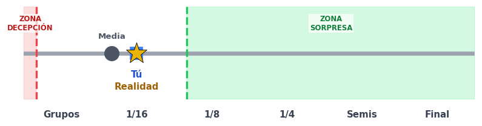 | ⚪ *Sin Premio* (0 pts) |
| **Arabia Saudita** | **Tú:** 0 **Media:** 0.67 **Real:** 1 |  | ⚪ *Sin Premio* (0 pts) |
| **Argelia** | **Tú:** 0 **Media:** 0.0 **Real:** 0 |  | ⚪ *Sin Premio* (0 pts) |
| **Argentina** | **Tú:** 3 **Media:** 3.0 **Real:** 3 | 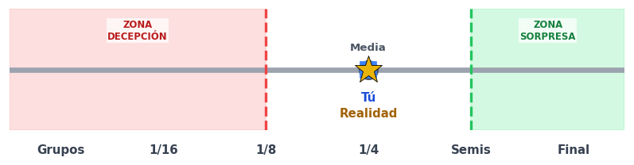 | ⚪ *Sin Premio* (0 pts) |
| **Australia** | **Tú:** 0 **Media:** 0.0 **Real:** 0 |  | ⚪ *Sin Premio* (0 pts) |
| **Austria** | **Tú:** 1 **Media:** 0.67 **Real:** 1 |  | ⚪ *Sin Premio* (0 pts) |
| **Bosnia-Herzegovina** | **Tú:** 0 **Media:** 0.0 **Real:** 0 |  | ⚪ *Sin Premio* (0 pts) |
| **Brasil** | **Tú:** 3 **Media:** 3.0 **Real:** 3 |  | ⚪ *Sin Premio* (0 pts) |
| **Bélgica** | **Tú:** 3 **Media:** 3.0 **Real:** 3 | 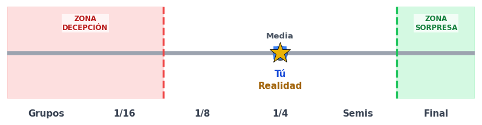 | ⚪ *Sin Premio* (0 pts) |
| **Cabo Verde** | **Tú:** 0 **Media:** 0.0 **Real:** 0 |  | ⚪ *Sin Premio* (0 pts) |
| **Canadá** | **Tú:** 2 **Media:** 2.0 **Real:** 2 | 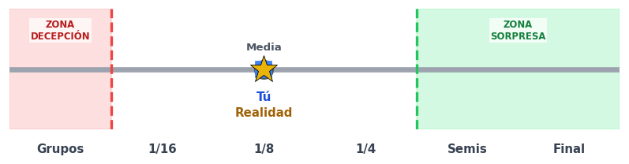 | ⚪ *Sin Premio* (0 pts) |
| **Colombia** | **Tú:** 5 **Media:** 5.0 **Real:** 4 |  | ⚪ *Sin Premio* (0 pts) |
| **Corea del Sur** | **Tú:** 1 **Media:** 0.67 **Real:** 1 |  | ⚪ *Sin Premio* (0 pts) |
| **Costa de Marfil** | **Tú:** 1 **Media:** 0.67 **Real:** 1 |  | ⚪ *Sin Premio* (0 pts) |
| **Croacia** | **Tú:** 1 **Media:** 0.67 **Real:** 1 |  | ⚪ *Sin Premio* (0 pts) |
| **Curazao** | **Tú:** 0 **Media:** 0.0 **Real:** 0 |  | ⚪ *Sin Premio* (0 pts) |
| **Ecuador** | **Tú:** 2 **Media:** 2.0 **Real:** 2 |  | ⚪ *Sin Premio* (0 pts) |
| **Egipto** | **Tú:** 1 **Media:** 1.0 **Real:** 1 |  | ⚪ *Sin Premio* (0 pts) |
| **Escocia** | **Tú:** 1 **Media:** 0.67 **Real:** 1 |  | ⚪ *Sin Premio* (0 pts) |
| **España** | **Tú:** 5 **Media:** 5.0 **Real:** 5 | 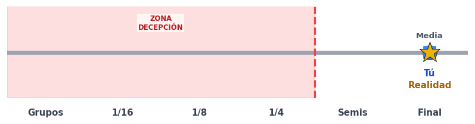 | ⚪ *Sin Premio* (0 pts) |
| **Estados Unidos** | **Tú:** 0 **Media:** 1.33 **Real:** 2 |  | ⚪ *Sin Premio* (0 pts) |
| **Francia** | **Tú:** 5 **Media:** 5.0 **Real:** 4 | 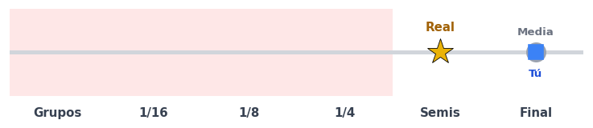 | ⚪ *Sin Premio* (0 pts) |
| **Ghana** | **Tú:** 1 **Media:** 1.0 **Real:** 1 |  | ⚪ *Sin Premio* (0 pts) |
| **Haití** | **Tú:** 0 **Media:** 0.0 **Real:** 0 |  | ⚪ *Sin Premio* (0 pts) |
| **Inglaterra** | **Tú:** 5 **Media:** 1.67 **Real:** 5 | 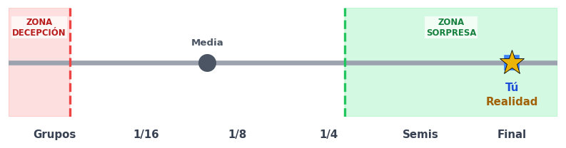 | 🟢 **+5 Pts** 🔥 ¡Sorpresa! |
| **Irak** | **Tú:** 0 **Media:** 0.0 **Real:** 0 | 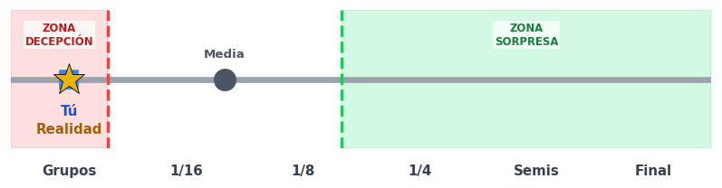 | ⚪ *Sin Premio* (0 pts) |
| **Irán** | **Tú:** 0 **Media:** 0.33 **Real:** 1 | 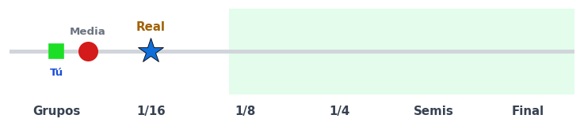 | ⚪ *Sin Premio* (0 pts) |
| **Japón** | **Tú:** 1 **Media:** 1.0 **Real:** 1 |  | ⚪ *Sin Premio* (0 pts) |
| **Jordania** | **Tú:** 0 **Media:** 0.0 **Real:** 0 |  | ⚪ *Sin Premio* (0 pts) |
| **Marruecos** | **Tú:** 3 **Media:** 3.0 **Real:** 3 | 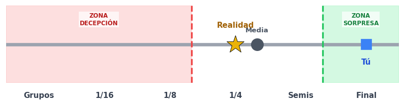 | ⚪ *Sin Premio* (0 pts) |
| **México** | **Tú:** 0 **Media:** 0.0 **Real:** 2 | 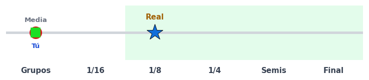 | ⚪ *Sin Premio* (0 pts) |
| **Noruega** | **Tú:** 2 **Media:** 1.33 **Real:** 2 | 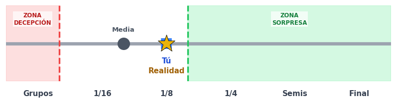 | ⚪ *Sin Premio* (0 pts) |
| **Nueva Zelanda** | **Tú:** 0 **Media:** 0.0 **Real:** 0 |  | ⚪ *Sin Premio* (0 pts) |
| **Panamá** | **Tú:** 0 **Media:** 0.0 **Real:** 0 |  | ⚪ *Sin Premio* (0 pts) |
| **Paraguay** | **Tú:** 2 **Media:** 2.0 **Real:** 2 |  | ⚪ *Sin Premio* (0 pts) |
| **Países Bajos** | **Tú:** 1 **Media:** 1.0 **Real:** 1 |  | ⚪ *Sin Premio* (0 pts) |
| **Portugal** | **Tú:** 2 **Media:** 1.33 **Real:** 2 |  | ⚪ *Sin Premio* (0 pts) |
| **Qatar** | **Tú:** 0 **Media:** 0.0 **Real:** 0 |  | ⚪ *Sin Premio* (0 pts) |
| **RD Congo** | **Tú:** 0 **Media:** 0.0 **Real:** 0 |  | ⚪ *Sin Premio* (0 pts) |
| **República Checa** | **Tú:** 1 **Media:** 1.0 **Real:** 1 |  | ⚪ *Sin Premio* (0 pts) |
| **Senegal** | **Tú:** 1 **Media:** 1.0 **Real:** 1 |  | ⚪ *Sin Premio* (0 pts) |
| **Sudáfrica** | **Tú:** 0 **Media:** 0.0 **Real:** 0 |  | ⚪ *Sin Premio* (0 pts) |
| **Suecia** | **Tú:** 1 **Media:** 1.0 **Real:** 1 |  | ⚪ *Sin Premio* (0 pts) |
| **Suiza** | **Tú:** 2 **Media:** 2.0 **Real:** 2 |  | ⚪ *Sin Premio* (0 pts) |
| **Turquía** | **Tú:** 0 **Media:** 0.0 **Real:** 0 |  | ⚪ *Sin Premio* (0 pts) |
| **Túnez** | **Tú:** 0 **Media:** 0.0 **Real:** 0 | 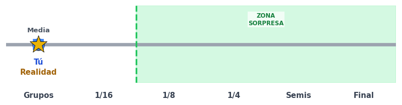 | ⚪ *Sin Premio* (0 pts) |
| **Uruguay** | **Tú:** 1 **Media:** 1.0 **Real:** 1 | 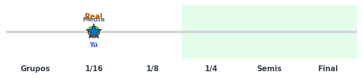 | ⚪ *Sin Premio* (0 pts) |
| **Uzbekistán** | **Tú:** 0 **Media:** 0.0 **Real:** 0 |  | ⚪ *Sin Premio* (0 pts) |

> 💡 **Guía Visual del Eje:** `⚪` Media del grupo \| `📌` Tu Pronóstico \| `🎯` Resultado Real \| `🟩` Umbral de Sorpresa Valido \| `🟥` Umbral de Decepción Valido.

---
[⬅️ Volver a la clasificación general](../../README.md)