# 👤 Perfil de Jugador: Pau
### Posición Actual: **1º** | Puntos Totales: **0**
---
## 📅 Historial Cronológico de Partidos
Aquí tienes el detalle exacto de tus pronósticos y resultados oficiales.
### 📌 J1.1
| Partido Oficial | Tu Pronóstico | Resultado Real | 1X2 | Exacto | Mult. | Pts |
| :--- | :---: | :---: | :---: | :---: | :---: | :---: |
| **Estados Unidos** vs **Paraguay** | **3 - 0** | ⏳ | ⏳ | ⏳ | x1.0 | **0** |
| **Australia** vs **Turquía** | **2 - 1** | ⏳ | ⏳ | ⏳ | x1.0 | **0** |
| **Países Bajos** vs **Japón** | **2 - 1** | ⏳ | ⏳ | ⏳ | x1.0 | **0** |
| **Suecia** vs **Túnez** | **1 - 1** | ⏳ | ⏳ | ⏳ | x1.0 | **0** |
| **Alemania** vs **Curazao** | **4 - 1** | ⏳ | ⏳ | ⏳ | x1.0 | **0** |
| **Costa de Marfil** vs **Ecuador** | **1 - 2** | ⏳ | ⏳ | ⏳ | x1.0 | **0** |
| **México** vs **Sudáfrica** | **1 - 0** | ⏳ | ⏳ | ⏳ | x1.0 | **0** |
| **Corea del Sur** vs **República Checa** | **1 - 2** | ⏳ | ⏳ | ⏳ | x1.0 | **0** |
| **Brasil** vs **Marruecos** | **2 - 0** | ⏳ | ⏳ | ⏳ | x1.0 | **0** |
| **Haití** vs **Escocia** | **0 - 2** | ⏳ | ⏳ | ⏳ | x1.0 | **0** |
| **Canadá** vs **Bosnia-Herzegovina** | **2 - 1** | ⏳ | ⏳ | ⏳ | x1.0 | **0** |
| **Qatar** vs **Suiza** | **1 - 2** | ⏳ | ⏳ | ⏳ | x1.0 | **0** |

> *Jornada pendiente o sin procesar.*

### 📌 J1.2
| Partido Oficial | Tu Pronóstico | Resultado Real | 1X2 | Exacto | Mult. | Pts |
| :--- | :---: | :---: | :---: | :---: | :---: | :---: |
| **Argentina** vs **Argelia** | **4 - 1** | ⏳ | ⏳ | ⏳ | x1.0 | **0** |
| **Austria** vs **Jordania** | **2 - 0** | ⏳ | ⏳ | ⏳ | x1.0 | **0** |
| **Portugal** vs **RD Congo** | **3 - 1** | ⏳ | ⏳ | ⏳ | x1.0 | **0** |
| **Uzbekistán** vs **Colombia** | **0 - 2** | ⏳ | ⏳ | ⏳ | x1.0 | **0** |
| **Inglaterra** vs **Croacia** | **2 - 0** | ⏳ | ⏳ | ⏳ | x1.0 | **0** |
| **Ghana** vs **Panamá** | **2 - 0** | ⏳ | ⏳ | ⏳ | x1.0 | **0** |
| **Bélgica** vs **Egipto** | **2 - 1** | ⏳ | ⏳ | ⏳ | x1.0 | **0** |
| **Irán** vs **Nueva Zelanda** | **1 - 0** | ⏳ | ⏳ | ⏳ | x1.0 | **0** |
| **España** vs **Cabo Verde** | **5 - 1** | ⏳ | ⏳ | ⏳ | x1.0 | **0** |
| **Arabia Saudita** vs **Uruguay** | **0 - 2** | ⏳ | ⏳ | ⏳ | x1.0 | **0** |
| **Francia** vs **Senegal** | **2 - 1** | ⏳ | ⏳ | ⏳ | x1.0 | **0** |
| **Irak** vs **Noruega** | **1 - 3** | ⏳ | ⏳ | ⏳ | x1.0 | **0** |

> *Jornada pendiente o sin procesar.*

### 📌 J2.1
| Partido Oficial | Tu Pronóstico | Resultado Real | 1X2 | Exacto | Mult. | Pts |
| :--- | :---: | :---: | :---: | :---: | :---: | :---: |
| **Estados Unidos** vs **Australia** | **2 - 0** | ⏳ | ⏳ | ⏳ | x1.0 | **0** |
| **Turquía** vs **Paraguay** | **3 - 4** | ⏳ | ⏳ | ⏳ | x1.0 | **0** |
| **Países Bajos** vs **Suecia** | **2 - 1** | ⏳ | ⏳ | ⏳ | x1.0 | **0** |
| **Túnez** vs **Japón** | **0 - 1** | ⏳ | ⏳ | ⏳ | x1.0 | **0** |
| **Alemania** vs **Costa de Marfil** | **1 - 1** | ⏳ | ⏳ | ⏳ | x1.0 | **0** |
| **Ecuador** vs **Curazao** | **2 - 0** | ⏳ | ⏳ | ⏳ | x1.0 | **0** |
| **República Checa** vs **Sudáfrica** | **2 - 1** | ⏳ | ⏳ | ⏳ | x1.0 | **0** |
| **México** vs **Corea del Sur** | **2 - 1** | ⏳ | ⏳ | ⏳ | x1.0 | **0** |
| **Escocia** vs **Marruecos** | **1 - 2** | ⏳ | ⏳ | ⏳ | x1.0 | **0** |
| **Brasil** vs **Haití** | **3 - 0** | ⏳ | ⏳ | ⏳ | x1.0 | **0** |
| **Suiza** vs **Bosnia-Herzegovina** | **2 - 0** | ⏳ | ⏳ | ⏳ | x1.0 | **0** |
| **Canadá** vs **Qatar** | **3 - 1** | ⏳ | ⏳ | ⏳ | x1.0 | **0** |

> *Jornada pendiente o sin procesar.*

### 📌 J2.2
| Partido Oficial | Tu Pronóstico | Resultado Real | 1X2 | Exacto | Mult. | Pts |
| :--- | :---: | :---: | :---: | :---: | :---: | :---: |
| **Argentina** vs **Austria** | **3 - 1** | ⏳ | ⏳ | ⏳ | x1.0 | **0** |
| **Jordania** vs **Argelia** | **1 - 2** | ⏳ | ⏳ | ⏳ | x1.0 | **0** |
| **Portugal** vs **Uzbekistán** | **2 - 1** | ⏳ | ⏳ | ⏳ | x1.0 | **0** |
| **Colombia** vs **RD Congo** | **3 - 0** | ⏳ | ⏳ | ⏳ | x1.0 | **0** |
| **Inglaterra** vs **Ghana** | **3 - 2** | ⏳ | ⏳ | ⏳ | x1.0 | **0** |
| **Panamá** vs **Croacia** | **1 - 2** | ⏳ | ⏳ | ⏳ | x1.0 | **0** |
| **Bélgica** vs **Irán** | **2 - 1** | ⏳ | ⏳ | ⏳ | x1.0 | **0** |
| **Nueva Zelanda** vs **Egipto** | **1 - 3** | ⏳ | ⏳ | ⏳ | x1.0 | **0** |
| **España** vs **Arabia Saudita** | **3 - 1** | ⏳ | ⏳ | ⏳ | x1.0 | **0** |
| **Uruguay** vs **Cabo Verde** | **2 - 0** | ⏳ | ⏳ | ⏳ | x1.0 | **0** |
| **Francia** vs **Irak** | **3 - 0** | ⏳ | ⏳ | ⏳ | x1.0 | **0** |
| **Noruega** vs **Senegal** | **4 - 2** | ⏳ | ⏳ | ⏳ | x1.0 | **0** |

> *Jornada pendiente o sin procesar.*

### 📌 J3.1
| Partido Oficial | Tu Pronóstico | Resultado Real | 1X2 | Exacto | Mult. | Pts |
| :--- | :---: | :---: | :---: | :---: | :---: | :---: |
| **Paraguay** vs **Australia** | **4 - 0** | ⏳ | ⏳ | ⏳ | x1.0 | **0** |
| **Turquía** vs **Estados Unidos** | **2 - 2** | ⏳ | ⏳ | ⏳ | x1.0 | **0** |
| **Japón** vs **Suecia** | **1 - 2** | ⏳ | ⏳ | ⏳ | x1.0 | **0** |
| **Túnez** vs **Países Bajos** | **1 - 3** | ⏳ | ⏳ | ⏳ | x1.0 | **0** |
| **Curazao** vs **Costa de Marfil** | **1 - 2** | ⏳ | ⏳ | ⏳ | x1.0 | **0** |
| **Ecuador** vs **Alemania** | **2 - 0** | ⏳ | ⏳ | ⏳ | x1.0 | **0** |
| **Sudáfrica** vs **Corea del Sur** | **1 - 2** | ⏳ | ⏳ | ⏳ | x1.0 | **0** |
| **República Checa** vs **México** | **2 - 3** | ⏳ | ⏳ | ⏳ | x1.0 | **0** |
| **Escocia** vs **Brasil** | **2 - 2** | ⏳ | ⏳ | ⏳ | x1.0 | **0** |
| **Marruecos** vs **Haití** | **2 - 0** | ⏳ | ⏳ | ⏳ | x1.0 | **0** |
| **Bosnia-Herzegovina** vs **Qatar** | **0 - 0** | ⏳ | ⏳ | ⏳ | x1.0 | **0** |
| **Suiza** vs **Canadá** | **1 - 1** | ⏳ | ⏳ | ⏳ | x1.0 | **0** |

> *Jornada pendiente o sin procesar.*

### 📌 J3.2
| Partido Oficial | Tu Pronóstico | Resultado Real | 1X2 | Exacto | Mult. | Pts |
| :--- | :---: | :---: | :---: | :---: | :---: | :---: |
| **Argelia** vs **Austria** | **1 - 2** | ⏳ | ⏳ | ⏳ | x1.0 | **0** |
| **Jordania** vs **Argentina** | **0 - 2** | ⏳ | ⏳ | ⏳ | x1.0 | **0** |
| **RD Congo** vs **Uzbekistán** | **2 - 1** | ⏳ | ⏳ | ⏳ | x1.0 | **0** |
| **Colombia** vs **Portugal** | **3 - 1** | ⏳ | ⏳ | ⏳ | x1.0 | **0** |
| **Croacia** vs **Ghana** | **1 - 2** | ⏳ | ⏳ | ⏳ | x1.0 | **0** |
| **Panamá** vs **Inglaterra** | **1 - 2** | ⏳ | ⏳ | ⏳ | x1.0 | **0** |
| **Nueva Zelanda** vs **Bélgica** | **2 - 3** | ⏳ | ⏳ | ⏳ | x1.0 | **0** |
| **Egipto** vs **Irán** | **2 - 1** | ⏳ | ⏳ | ⏳ | x1.0 | **0** |
| **Cabo Verde** vs **Arabia Saudita** | **1 - 3** | ⏳ | ⏳ | ⏳ | x1.0 | **0** |
| **Uruguay** vs **España** | **1 - 1** | ⏳ | ⏳ | ⏳ | x1.0 | **0** |
| **Senegal** vs **Irak** | **3 - 0** | ⏳ | ⏳ | ⏳ | x1.0 | **0** |
| **Noruega** vs **Francia** | **1 - 3** | ⏳ | ⏳ | ⏳ | x1.0 | **0** |

> *Jornada pendiente o sin procesar.*

---
## 📊 BALANCE DE FASE DE GRUPOS
**Puntos obtenidos en partidos:** 0 pts
**Puntos extra de jornadas:** 0 pts
**TOTAL FASE DE GRUPOS (Sin contar bonos de pase): 0 pts**

### Análisis de los 48 Equipos (Pase a Eliminatorias)
| Equipo | Pasa (Tú) | Pos (Tú) | Pasa (Real) | Pos (Real) | Acierto Pase | Acierto Posición | Puntos |
| :--- | :---: | :---: | :---: | :---: | :---: | :---: | :---: |
| **Alemania** | ✅ | 2º | ❌ | 1º | - | - | **0** |
| **Arabia Saudita** | ✅ | 3º | ❌ | 3º | - | - | **0** |
| **Argelia** | ❌ | 3º | ❌ | 2º | - | - | **0** |
| **Argentina** | ✅ | 1º | ❌ | 1º | - | - | **0** |
| **Australia** | ❌ | 3º | ❌ | 3º | - | - | **0** |
| **Austria** | ✅ | 2º | ❌ | 3º | - | - | **0** |
| **Bosnia-Herzegovina** | ❌ | 3º | ❌ | 2º | - | - | **0** |
| **Brasil** | ✅ | 1º | ❌ | 1º | - | - | **0** |
| **Bélgica** | ✅ | 1º | ❌ | 1º | - | - | **0** |
| **Cabo Verde** | ❌ | 4º | ❌ | 2º | - | - | **0** |
| **Canadá** | ✅ | 1º | ❌ | 1º | - | - | **0** |
| **Colombia** | ✅ | 1º | ❌ | 4º | - | - | **0** |
| **Corea del Sur** | ✅ | 3º | ❌ | 3º | - | - | **0** |
| **Costa de Marfil** | ✅ | 3º | ❌ | 3º | - | - | **0** |
| **Croacia** | ✅ | 3º | ❌ | 2º | - | - | **0** |
| **Curazao** | ❌ | 4º | ❌ | 2º | - | - | **0** |
| **Ecuador** | ✅ | 1º | ❌ | 4º | - | - | **0** |
| **Egipto** | ✅ | 2º | ❌ | 2º | - | - | **0** |
| **Escocia** | ✅ | 3º | ❌ | 4º | - | - | **0** |
| **España** | ✅ | 1º | ❌ | 1º | - | - | **0** |
| **Estados Unidos** | ✅ | 1º | ❌ | 1º | - | - | **0** |
| **Francia** | ✅ | 1º | ❌ | 1º | - | - | **0** |
| **Ghana** | ✅ | 2º | ❌ | 3º | - | - | **0** |
| **Haití** | ❌ | 4º | ❌ | 3º | - | - | **0** |
| **Inglaterra** | ✅ | 1º | ❌ | 1º | - | - | **0** |
| **Irak** | ❌ | 4º | ❌ | 3º | - | - | **0** |
| **Irán** | ✅ | 3º | ❌ | 3º | - | - | **0** |
| **Japón** | ✅ | 3º | ❌ | 2º | - | - | **0** |
| **Jordania** | ❌ | 4º | ❌ | 4º | - | - | **0** |
| **Marruecos** | ✅ | 2º | ❌ | 2º | - | - | **0** |
| **México** | ✅ | 1º | ❌ | 1º | - | - | **0** |
| **Noruega** | ✅ | 2º | ❌ | 4º | - | - | **0** |
| **Nueva Zelanda** | ❌ | 4º | ❌ | 4º | - | - | **0** |
| **Panamá** | ❌ | 4º | ❌ | 4º | - | - | **0** |
| **Paraguay** | ✅ | 2º | ❌ | 2º | - | - | **0** |
| **Países Bajos** | ✅ | 1º | ❌ | 1º | - | - | **0** |
| **Portugal** | ✅ | 2º | ❌ | 1º | - | - | **0** |
| **Qatar** | ❌ | 4º | ❌ | 3º | - | - | **0** |
| **RD Congo** | ❌ | 3º | ❌ | 2º | - | - | **0** |
| **República Checa** | ✅ | 2º | ❌ | 4º | - | - | **0** |
| **Senegal** | ✅ | 3º | ❌ | 2º | - | - | **0** |
| **Sudáfrica** | ❌ | 4º | ❌ | 2º | - | - | **0** |
| **Suecia** | ✅ | 2º | ❌ | 3º | - | - | **0** |
| **Suiza** | ✅ | 2º | ❌ | 4º | - | - | **0** |
| **Turquía** | ❌ | 4º | ❌ | 4º | - | - | **0** |
| **Túnez** | ❌ | 4º | ❌ | 4º | - | - | **0** |
| **Uruguay** | ✅ | 2º | ❌ | 4º | - | - | **0** |
| **Uzbekistán** | ❌ | 4º | ❌ | 3º | - | - | **0** |

> **Resumen de Clasificados:** **0/0** *(Clavados/Aciertos Pase)*
> **Bono sumado por Fase de Grupos:** +0 pts | **TOTAL ACUMULADO:** 0 pts

---
### 📌 DIECISEISAVOS.1
| Partido Oficial | Tu Pronóstico | Resultado Real | 1X2 | Exacto | Mult. | Origen Extra | Pts |
| :--- | :---: | :---: | :---: | :---: | :---: | :--- | :---: |
| **2A** vs **2B** | - | ⏳ | ⏳ | ⏳ | x1.0 | - | **0** |
| **1E** vs **3A/3B/3C/3D/3F** | - | ⏳ | ⏳ | ⏳ | x1.0 | - | **0** |
| **1F** vs **2C** | - | ⏳ | ⏳ | ⏳ | x1.0 | - | **0** |
| **1C** vs **2F** | - | ⏳ | ⏳ | ⏳ | x1.0 | - | **0** |
| **1I** vs **3C/3D/3F/3G/3H** | - | ⏳ | ⏳ | ⏳ | x1.0 | - | **0** |
| **2E** vs **2I** | - | ⏳ | ⏳ | ⏳ | x1.0 | - | **0** |
| **1A** vs **3C/3E/3F/3H/3I** | - | ⏳ | ⏳ | ⏳ | x1.0 | - | **0** |
| **1L** vs **3E/3H/3I/3J/3K** | - | ⏳ | ⏳ | ⏳ | x1.0 | - | **0** |

> *Jornada pendiente o sin procesar.*

### 📌 DIECISEISAVOS.2
| Partido Oficial | Tu Pronóstico | Resultado Real | 1X2 | Exacto | Mult. | Origen Extra | Pts |
| :--- | :---: | :---: | :---: | :---: | :---: | :--- | :---: |
| **1D** vs **3B/3E/3F/3I/3J** | - | ⏳ | ⏳ | ⏳ | x1.0 | - | **0** |
| **1G** vs **3A/3E/3H/3I/3J** | - | ⏳ | ⏳ | ⏳ | x1.0 | - | **0** |
| **2K** vs **2L** | - | ⏳ | ⏳ | ⏳ | x1.0 | - | **0** |
| **1H** vs **2J** | - | ⏳ | ⏳ | ⏳ | x1.0 | - | **0** |
| **1B** vs **3E/3F/3G/3I/3J** | - | ⏳ | ⏳ | ⏳ | x1.0 | - | **0** |
| **1J** vs **2H** | - | ⏳ | ⏳ | ⏳ | x1.0 | - | **0** |
| **1K** vs **3D/3E/3I/3J/3L** | - | ⏳ | ⏳ | ⏳ | x1.0 | - | **0** |
| **2D** vs **2G** | - | ⏳ | ⏳ | ⏳ | x1.0 | - | **0** |

> *Jornada pendiente o sin procesar.*

### 📌 OCTAVOS
| Partido Oficial | Tu Pronóstico | Resultado Real | 1X2 | Exacto | Mult. | Origen Extra | Pts |
| :--- | :---: | :---: | :---: | :---: | :---: | :--- | :---: |
| **Ganador 73** vs **Ganador 74** | - | ⏳ | ⏳ | ⏳ | x1.0 | - | **0** |
| **Ganador 75** vs **Ganador 76** | - | ⏳ | ⏳ | ⏳ | x1.0 | - | **0** |
| **Ganador 77** vs **Ganador 78** | - | ⏳ | ⏳ | ⏳ | x1.0 | - | **0** |
| **Ganador 79** vs **Ganador 80** | - | ⏳ | ⏳ | ⏳ | x1.0 | - | **0** |
| **Ganador 81** vs **Ganador 82** | - | ⏳ | ⏳ | ⏳ | x1.0 | - | **0** |
| **Ganador 83** vs **Ganador 84** | - | ⏳ | ⏳ | ⏳ | x1.0 | - | **0** |
| **Ganador 85** vs **Ganador 86** | - | ⏳ | ⏳ | ⏳ | x1.0 | - | **0** |
| **Ganador 87** vs **Ganador 88** | - | ⏳ | ⏳ | ⏳ | x1.0 | - | **0** |

> *Jornada pendiente o sin procesar.*

### 📌 CUARTOS
| Partido Oficial | Tu Pronóstico | Resultado Real | 1X2 | Exacto | Mult. | Origen Extra | Pts |
| :--- | :---: | :---: | :---: | :---: | :---: | :--- | :---: |
| **Ganador 89** vs **Ganador 90** | - | ⏳ | ⏳ | ⏳ | x1.0 | - | **0** |
| **Ganador 91** vs **Ganador 92** | - | ⏳ | ⏳ | ⏳ | x1.0 | - | **0** |
| **Ganador 93** vs **Ganador 94** | - | ⏳ | ⏳ | ⏳ | x1.0 | - | **0** |
| **Ganador 95** vs **Ganador 96** | - | ⏳ | ⏳ | ⏳ | x1.0 | - | **0** |

> *Jornada pendiente o sin procesar.*

### 📌 SEMIFINALES
| Partido Oficial | Tu Pronóstico | Resultado Real | 1X2 | Exacto | Mult. | Origen Extra | Pts |
| :--- | :---: | :---: | :---: | :---: | :---: | :--- | :---: |
| **Ganador 97** vs **Ganador 98** | - | ⏳ | ⏳ | ⏳ | x1.0 | - | **0** |
| **Ganador 99** vs **Ganador 100** | - | ⏳ | ⏳ | ⏳ | x1.0 | - | **0** |

> *Jornada pendiente o sin procesar.*

### 🥉 TERCER PUESTO
| Partido Oficial | Tu Pronóstico | Resultado Real | 1X2 | Exacto | Mult. | Origen Extra | Pts |
| :--- | :---: | :---: | :---: | :---: | :---: | :--- | :---: |
| **Perdedor 101** vs **Perdedor 102** | - | ⏳ | ⏳ | ⏳ | x1.0 | - | **0** |

### 🏆 FINAL
| Partido Oficial | Tu Pronóstico | Resultado Real | 1X2 | Exacto | Mult. | Origen Extra | Pts |
| :--- | :---: | :---: | :---: | :---: | :---: | :--- | :---: |
| **Ganador 101** vs **Ganador 102** | - | ⏳ | ⏳ | ⏳ | x1.0 | - | **0** |

> *Jornada pendiente o sin procesar.*

## 🎯 Matriz de Desviaciones: Sorpresas y Decepciones
Este gráfico analiza tu desviación respecto a la tendencia central de la comunidad. Las zonas coloreadas (umbrales) se basan en la **varianza global** de todos los pronósticos, creando una regla de juego justa e idéntica para todas las selecciones.

| Selección | Datos | Gráfico de Rendimiento | Estado |
| :--- | :---: | :---: | :---: |
| **Alemania** | **Tú:** 1 **Media:** 1.0 **Real:** 0 **Margen:** ±1.0 |  | ⚪ *Sin Premio* (0 pts) |
| **Arabia Saudita** | **Tú:** 1 **Media:** 1.0 **Real:** 0 **Margen:** ±1.0 |  | ⚪ *Sin Premio* (0 pts) |
| **Argelia** | **Tú:** 0 **Media:** 0.0 **Real:** 0 **Margen:** ±1.0 |  | ⚪ *Sin Premio* (0 pts) |
| **Argentina** | **Tú:** 3 **Media:** 3.0 **Real:** 0 **Margen:** ±1.0 |  | ⚪ *Sin Premio* (0 pts) |
| **Australia** | **Tú:** 0 **Media:** 0.0 **Real:** 0 **Margen:** ±1.0 |  | ⚪ *Sin Premio* (0 pts) |
| **Austria** | **Tú:** 1 **Media:** 1.0 **Real:** 0 **Margen:** ±1.0 |  | ⚪ *Sin Premio* (0 pts) |
| **Bosnia-Herzegovina** | **Tú:** 0 **Media:** 0.0 **Real:** 0 **Margen:** ±1.0 |  | ⚪ *Sin Premio* (0 pts) |
| **Brasil** | **Tú:** 3 **Media:** 3.0 **Real:** 0 **Margen:** ±1.0 |  | ⚪ *Sin Premio* (0 pts) |
| **Bélgica** | **Tú:** 3 **Media:** 3.0 **Real:** 0 **Margen:** ±1.0 |  | ⚪ *Sin Premio* (0 pts) |
| **Cabo Verde** | **Tú:** 0 **Media:** 0.0 **Real:** 0 **Margen:** ±1.0 |  | ⚪ *Sin Premio* (0 pts) |
| **Canadá** | **Tú:** 2 **Media:** 2.0 **Real:** 0 **Margen:** ±1.0 |  | ⚪ *Sin Premio* (0 pts) |
| **Colombia** | **Tú:** 4 **Media:** 4.0 **Real:** 0 **Margen:** ±1.0 |  | ⚪ *Sin Premio* (0 pts) |
| **Corea del Sur** | **Tú:** 1 **Media:** 1.0 **Real:** 0 **Margen:** ±1.0 |  | ⚪ *Sin Premio* (0 pts) |
| **Costa de Marfil** | **Tú:** 1 **Media:** 1.0 **Real:** 0 **Margen:** ±1.0 |  | ⚪ *Sin Premio* (0 pts) |
| **Croacia** | **Tú:** 1 **Media:** 1.0 **Real:** 0 **Margen:** ±1.0 | 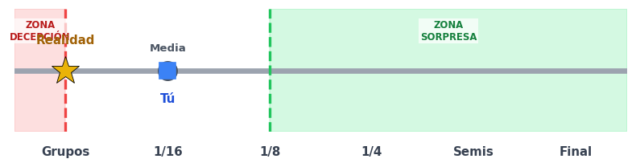 | ⚪ *Sin Premio* (0 pts) |
| **Curazao** | **Tú:** 0 **Media:** 0.0 **Real:** 0 **Margen:** ±1.0 |  | ⚪ *Sin Premio* (0 pts) |
| **Ecuador** | **Tú:** 2 **Media:** 2.0 **Real:** 0 **Margen:** ±1.0 | 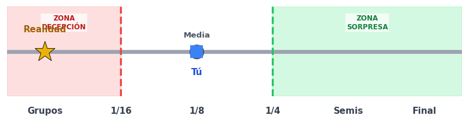 | ⚪ *Sin Premio* (0 pts) |
| **Egipto** | **Tú:** 1 **Media:** 1.0 **Real:** 0 **Margen:** ±1.0 |  | ⚪ *Sin Premio* (0 pts) |
| **Escocia** | **Tú:** 1 **Media:** 1.0 **Real:** 0 **Margen:** ±1.0 |  | ⚪ *Sin Premio* (0 pts) |
| **España** | **Tú:** 5 **Media:** 5.0 **Real:** 0 **Margen:** ±1.0 | 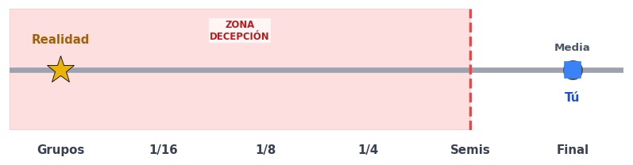 | ⚪ *Sin Premio* (0 pts) |
| **Estados Unidos** | **Tú:** 2 **Media:** 2.0 **Real:** 0 **Margen:** ±1.0 |  | ⚪ *Sin Premio* (0 pts) |
| **Francia** | **Tú:** 4 **Media:** 4.0 **Real:** 0 **Margen:** ±1.0 | 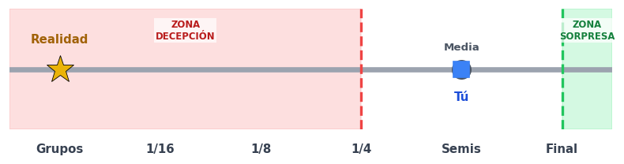 | ⚪ *Sin Premio* (0 pts) |
| **Ghana** | **Tú:** 1 **Media:** 1.0 **Real:** 0 **Margen:** ±1.0 |  | ⚪ *Sin Premio* (0 pts) |
| **Haití** | **Tú:** 0 **Media:** 0.0 **Real:** 0 **Margen:** ±1.0 |  | ⚪ *Sin Premio* (0 pts) |
| **Inglaterra** | **Tú:** 5 **Media:** 5.0 **Real:** 0 **Margen:** ±1.0 | 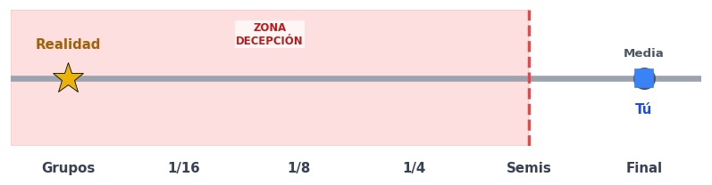 | ⚪ *Sin Premio* (0 pts) |
| **Irak** | **Tú:** 0 **Media:** 0.0 **Real:** 0 **Margen:** ±1.0 |  | ⚪ *Sin Premio* (0 pts) |
| **Irán** | **Tú:** 1 **Media:** 1.0 **Real:** 0 **Margen:** ±1.0 | 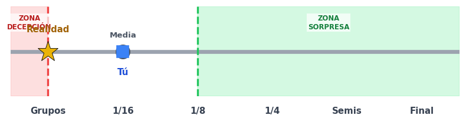 | ⚪ *Sin Premio* (0 pts) |
| **Japón** | **Tú:** 1 **Media:** 1.0 **Real:** 0 **Margen:** ±1.0 |  | ⚪ *Sin Premio* (0 pts) |
| **Jordania** | **Tú:** 0 **Media:** 0.0 **Real:** 0 **Margen:** ±1.0 |  | ⚪ *Sin Premio* (0 pts) |
| **Marruecos** | **Tú:** 3 **Media:** 3.0 **Real:** 0 **Margen:** ±1.0 | 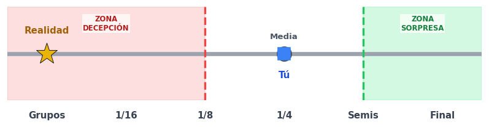 | ⚪ *Sin Premio* (0 pts) |
| **México** | **Tú:** 2 **Media:** 2.0 **Real:** 0 **Margen:** ±1.0 | 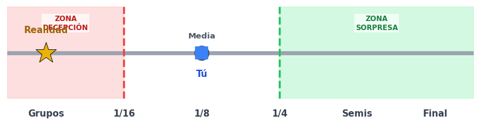 | ⚪ *Sin Premio* (0 pts) |
| **Noruega** | **Tú:** 2 **Media:** 2.0 **Real:** 0 **Margen:** ±1.0 |  | ⚪ *Sin Premio* (0 pts) |
| **Nueva Zelanda** | **Tú:** 0 **Media:** 0.0 **Real:** 0 **Margen:** ±1.0 |  | ⚪ *Sin Premio* (0 pts) |
| **Panamá** | **Tú:** 0 **Media:** 0.0 **Real:** 0 **Margen:** ±1.0 |  | ⚪ *Sin Premio* (0 pts) |
| **Paraguay** | **Tú:** 2 **Media:** 2.0 **Real:** 0 **Margen:** ±1.0 |  | ⚪ *Sin Premio* (0 pts) |
| **Países Bajos** | **Tú:** 1 **Media:** 1.0 **Real:** 0 **Margen:** ±1.0 |  | ⚪ *Sin Premio* (0 pts) |
| **Portugal** | **Tú:** 2 **Media:** 2.0 **Real:** 0 **Margen:** ±1.0 | 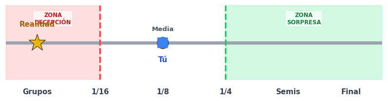 | ⚪ *Sin Premio* (0 pts) |
| **Qatar** | **Tú:** 0 **Media:** 0.0 **Real:** 0 **Margen:** ±1.0 |  | ⚪ *Sin Premio* (0 pts) |
| **RD Congo** | **Tú:** 0 **Media:** 0.0 **Real:** 0 **Margen:** ±1.0 |  | ⚪ *Sin Premio* (0 pts) |
| **República Checa** | **Tú:** 1 **Media:** 1.0 **Real:** 0 **Margen:** ±1.0 |  | ⚪ *Sin Premio* (0 pts) |
| **Senegal** | **Tú:** 1 **Media:** 1.0 **Real:** 0 **Margen:** ±1.0 |  | ⚪ *Sin Premio* (0 pts) |
| **Sudáfrica** | **Tú:** 0 **Media:** 0.0 **Real:** 0 **Margen:** ±1.0 |  | ⚪ *Sin Premio* (0 pts) |
| **Suecia** | **Tú:** 1 **Media:** 1.0 **Real:** 0 **Margen:** ±1.0 | 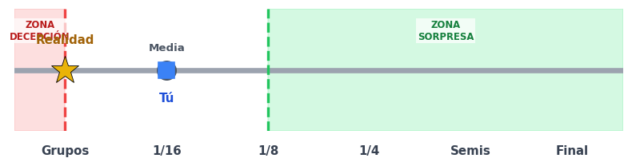 | ⚪ *Sin Premio* (0 pts) |
| **Suiza** | **Tú:** 2 **Media:** 2.0 **Real:** 0 **Margen:** ±1.0 |  | ⚪ *Sin Premio* (0 pts) |
| **Turquía** | **Tú:** 0 **Media:** 0.0 **Real:** 0 **Margen:** ±1.0 |  | ⚪ *Sin Premio* (0 pts) |
| **Túnez** | **Tú:** 0 **Media:** 0.0 **Real:** 0 **Margen:** ±1.0 | 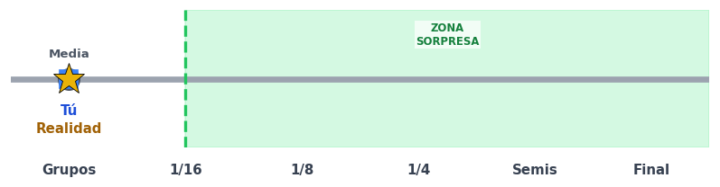 | ⚪ *Sin Premio* (0 pts) |
| **Uruguay** | **Tú:** 1 **Media:** 1.0 **Real:** 0 **Margen:** ±1.0 |  | ⚪ *Sin Premio* (0 pts) |
| **Uzbekistán** | **Tú:** 0 **Media:** 0.0 **Real:** 0 **Margen:** ±1.0 |  | ⚪ *Sin Premio* (0 pts) |

> 💡 **Guía Visual del Eje:** `⚪` Media del grupo \| `📌` Tu Pronóstico \| `🎯` Resultado Real \| `🟩` Umbral de Sorpresa Valido \| `🟥` Umbral de Decepción Valido.

---
[⬅️ Volver a la clasificación general](../../README.md)